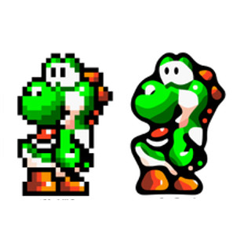
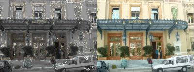
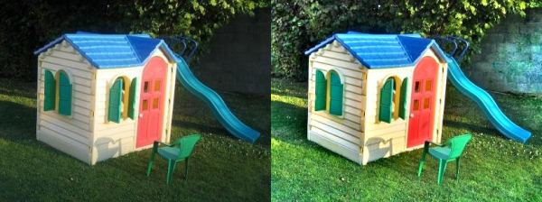
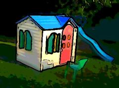
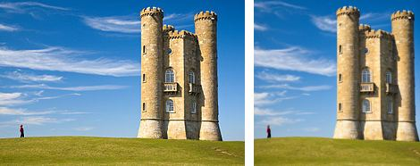
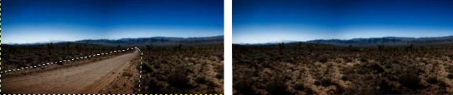
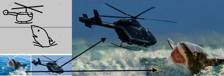
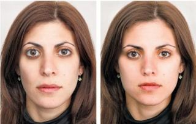

# Technology Solution Library 
__Series in Technology Research. Creative based on profitable demand in development, innovation in the life and industry sectors__

__Respect for Nature - Respect for Truth - Respect for Human__

+ [List of algorithm](https://en.wikipedia.org/wiki/List_of_algorithms)
+ Problem solving
+ Mathematics
+ Statitics
+ Artificial intelligence algorithm classification
+ Machine learning algorithm classification
+ Deep learning algorithm classification
+ Interdisciplinary algorithm:
  + Automata
    + Powerset construction: Algorithm to convert nondeterministic automaton to deterministic automaton.
    + Todd-Coxeter algorithm: Procedure for generating cosets (module).

  + Artificial intelligence
    + Computer vision
    + Genetic algorithms
    + Neural networks
    + Machine learning
  + Bioinformatics and cheminformatics
  + Compression
    + Lossless compression algorithms
    + Lossy compression algorithms
  + Cryptography
  + Geometry
  + Graphs
  + Graphics
  + Lists, arrays and trees
    + Searching
    + Sorting
    + Merging
  + Logic programming
  + Mathematics
    + Algebra
    + Arithmetic
    + Discrete logarithm
    + Integer factorization
    + Prime test
    + Numerical
    + Statistics
  + Matrix processing
  + Optic
  + Optimization
  + Parsing
  + Prediction (statistics)
  + Quantum
  + Random number generators
  + Sciences
    + Astronomy
    + Medical
    + Physical 
    + Chemistry 
    + Biology 
    + Economics 
  + Signal processing
  + Software engineering
    + Memory allocation
    + Distributed systems
    + Operating systems algorithms (disk, scheduling, paging, memory,...)
  + Texts
    + Searching
    + Approximate matching
    + Word processing
  + Misc
    + [FixedNN: Turns a sketch into a photo](http://www.cs.cmu.edu/~aayushb/pixelNN/) 
    + Graphics algorithm:
      + Depixelizing Pixel Art

        
      + Black and white image

        
      + Restore a picture or make a High dynamic range (HDR) image

        
      + Turn a photo into drawing and vice versa 

        
      + Seam carving

        
      + Remove an object

        
      + Compose a picture

        
      + Beautify a face
        
        

