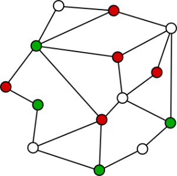

# Technology Solution Library 
__Series in Technology Research__

List of ebook, source code, projects, processing huge data, foundation in computer science, open source, science research in the technology area. The first elementary in science research that should clearly realize and certainly understand origin of the phenomenon from tiny independence physical properties and details to combination in real object in the life before intent to any theory research. 

The following list below that genre of the technological ebook include:

+ Mathematics (Computer Science)
+ Physics (Computer Science)
+ Chemistry (Computer Science)
+ integrated Circuit (IC)
+ Electronics
+ Semiconductor
+ Hardware 
+ PC Troubleshooting
+ Microcontroller
+ Microcontroller
+ Processor
+ Machine code
+ Upgrade logic device
+ Assembly
+ Quantum computer
+ Supercomputer
+ Algorithms 
+ Programming language
+ Supervisory Control And Data Acquisition (SCADA)
+ Software Engineering
+ Artificial Intelligence
+ Machine Learning
+ Deep Learning
+ Deep Learning (Assembly)
+ Computer Vision 
+ Machine Vision 
+ Robot Vision 
+ Web Technology
+ Game Theory 
+ System Information 
+ Networking Computer
+ Mainframe
+ Telecommunication 
+ Multimedia
+ Information Security
+ Hacking (anything)
+ Mechanics
+ Microelectromechanical Systems (MEMs)
+ Microfluidics
+ Nanotechnology
+ Manufacturing
